# 🕵️ Market Research Crew - Because I Was Tired of Googling Things

> *"Why do the research yourself when you can build an army of AI agents to do it for you?"* - Me, probably at 3 AM

## 🤔 What Even Is This?

Look, I'll be honest. I got tired of spending hours doing market research, competitive analysis, and pretending I understand what customers actually want. So naturally, I did what any rational person would do: I spent even MORE hours building an AI crew to do it for me.

This is a **CrewAI-powered market research automation system** that deploys 5 specialized AI agents to do all the heavy lifting. Think of it as your personal research department, except they don't need coffee breaks, never complain about Mondays, and work 24/7 without asking for a raise.

## 🎭 Meet the Dream Team

I've assembled a crew of AI specialists who are basically the Avengers of market research (if the Avengers wore business casual and carried clipboards):

1. **Market Research Specialist** 📊 - The data nerd who knows everything about market trends
2. **Competitive Intelligence Analyst** 🔍 - The spy who stalks your competitors (legally, of course)
3. **Customer Insights Researcher** 👥 - The mind reader who knows what customers want before they do
4. **Product Strategy Advisor** 🎯 - The strategist who turns chaos into actionable plans
5. **Business Analyst** 💼 - The boss who synthesizes everything into executive-friendly reports

## 🚀 How This Magic Works

Here's the workflow. It's beautiful, it's sequential, and it makes me feel like a conductor orchestrating a symphony (if symphonies generated markdown reports):

```mermaid
graph TD
    A[🎬 You: Give Topic] --> B[📊 Market Research Specialist]
    B -->|Market Insights| C[🔍 Competitive Intelligence Analyst]
    C -->|Competitor Analysis| D[👥 Customer Insights Researcher]
    D -->|Customer Data| E[🎯 Product Strategy Advisor]
    E -->|Product Strategy| F[💼 Business Analyst]
    F -->|Final Report| G[📝 Comprehensive Business Analysis]
    
    B -.->|Context| D
    B -.->|Context| E
    C -.->|Context| E
    
    style A fill:#e1f5ff
    style G fill:#d4edda
    style B fill:#fff3cd
    style C fill:#fff3cd
    style D fill:#fff3cd
    style E fill:#fff3cd
    style F fill:#fff3cd
```



## 🎯 What You Get

After my crew does its thing, you'll receive a comprehensive report that includes:

- 📈 **Market Analysis** - Size, trends, opportunities (the boring but important stuff)
- 🥊 **Competitive Landscape** - Who you're up against and how to beat them
- 💡 **Customer Insights** - What people actually want (not what we think they want)
- 🎨 **Product Strategy** - How to position your product like a boss
- 📋 **Business Recommendations** - The actionable game plan that makes you look smart in meetings

All neatly formatted in markdown and saved to `reports/report.md`. You're welcome.

## 🛠️ Tech Stack (AKA The Cool Stuff I Used)

- **CrewAI** - Because orchestrating AI agents is cooler than it sounds
- **Python 3.10+** - The language that runs half the internet
- **SerperDev** - For web searching without melting my API quota
- **Selenium & Web Scraping Tools** - For when you need to scrape the web like a digital detective
- **YAML** - Because I like my configs readable

## 📦 Installation (The "Please Work" Phase)

1. **Clone this bad boy:**
```bash
git clone <my-repo-url>
cd "MARKET RESEARCH CREW"
```

2. **Set up your environment:**
```bash
# Make sure you have Python 3.10-3.13
python --version

# Install dependencies
pip install -e .
```

3. **Configure your secrets:**
Create a `.env` file and add your API keys (don't worry, I `.gitignored` it):
```env
OPENAI_API_KEY=your_openai_key_here
SERPER_API_KEY=your_serper_key_here
```

## 🎮 How to Run This Beast

### The Easy Way (For Normal People)

```bash
# Just run it
market_research_crew
# or
run_crew
```

### The Custom Way (For Control Freaks Like Me)

Edit the topic in [main.py](src/market_research_crew/main.py):

```python
inputs = {
    'topic': 'Your amazing idea here',
    'current_year': str(datetime.now().year)
}
```

Then run:
```bash
python src/market_research_crew/main.py
```

### Other Cool Commands

```bash
# Train your crew (experimental, makes them smarter... allegedly)
market_research_crew train

# Replay a previous run (for nostalgia)
market_research_crew replay

# Run tests (to pretend you do TDD)
market_research_crew test
```

## 📂 Project Structure (For the Organized Among Us)

```
MARKET RESEARCH CREW/
├── src/market_research_crew/
│   ├── crew.py              # The orchestrator
│   ├── main.py              # Entry point
│   └── config/
│       ├── agents.yaml      # Agent personalities
│       └── tasks.yaml       # What each agent does
├── reports/
│   └── report.md            # Your shiny output
├── knowledge/
│   └── user_preference.txt  # Because personalization matters
└── pyproject.toml           # Python project config
```

## 🎨 Customization (Make It Yours)

Want to tweak the crew? Here's where to look:

- **Agent Behaviors:** Edit `config/agents.yaml` to change agent roles and backstories
- **Task Definitions:** Modify `config/tasks.yaml` to adjust what each agent does
- **Input Topic:** Change the topic in `main.py` to research whatever you want
- **Output Location:** The report goes to `reports/report.md` by default

## 🐛 Troubleshooting (When Things Go Wrong)

**"It's not working!"**
- Did you add your API keys to `.env`? (We all forget this)
- Is your Python version between 3.10 and 3.13? (Picky, I know)
- Did you install dependencies? (`pip install -e .`)

**"The agents are taking forever!"**
- Yeah, quality research takes time. Grab a coffee ☕
- Or tweak the tasks in `tasks.yaml` to be less comprehensive

**"The report is too long!"**
- That's... actually a feature? You asked for comprehensive!
- You can modify the `expected_output` in `tasks.yaml` to make it shorter

## 🎓 What I Learned Building This

1. AI agents are like herding cats, except the cats know more about market research than I do
2. YAML is great until you miss one indentation
3. Sequential processes are beautiful when they work
4. I should probably do more market research before building products (ironic, right?)

## 🤝 Contributing

Found a bug? Want to add features? PRs are welcome! Just remember:
- Keep it clean
- Keep it funny (optional but appreciated)
- Test your changes (also optional but please do)

## 📄 License

MIT License - Do whatever you want with it. Build empires, break things, I don't care. Just don't blame me if your market research suggests selling ice to penguins.

## 🙏 Acknowledgments

- **CrewAI** - For making AI orchestration actually enjoyable
- **Coffee** - For fueling this entire project
- **Stack Overflow** - For obvious reasons
- **My patience** - RIP, you will be missed

## 📞 Contact

Got questions? Found this helpful? Just want to chat about AI?

Feel free to reach out or open an issue. I promise I'll respond faster than my crew generates reports.

---

*Built with 🤖, ☕, and a concerning amount of time at 3 AM*

**P.S.** If you're reading this, you're probably procrastinating on doing actual market research. I see you. No judgment. 😉
