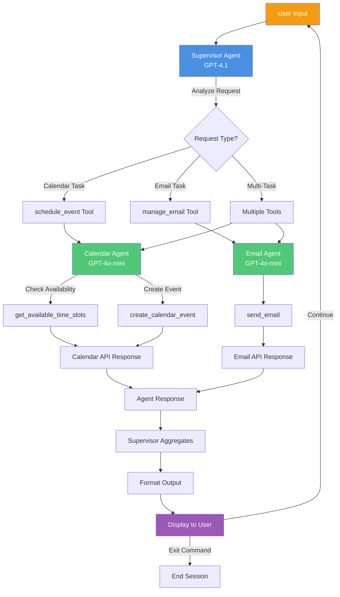

# Nexus AI Personal Assistant

A multi-agent AI system built with LangGraph and LangChain that helps manage calendar events and emails through natural language interactions. The assistant uses a supervisor-worker architecture with specialized agents for different tasks.

## Features

- **Calendar Management**: Schedule events, check availability, and parse natural language time expressions
- **Email Automation**: Compose and send emails using natural language requests
- **Multi-Agent Architecture**: Supervisor agent coordinates specialized worker agents
- **Interactive CLI**: Rich terminal interface with status indicators and formatted output
- **Conversation Memory**: In-memory state management for context-aware interactions

## Architecture

The system consists of three main agents:

### 1. Supervisor Agent
- **Model**: GPT-4.1 (Primary decision maker)
- **Tools**: 
  - `schedule_event`: Delegates calendar requests to the calendar agent
  - `manage_email`: Delegates email requests to the email agent
- **Role**: Receives user requests, breaks them down, and coordinates specialized agents

### 2. Calendar Agent
- **Model**: GPT-4o-mini (Worker)
- **Tools**:
  - `create_calendar_event`: Creates calendar events with title, time, attendees, and location
  - `get_available_time_slots`: Checks availability for specific dates and attendees
- **Role**: Handles all calendar-related operations and natural language time parsing

### 3. Email Agent
- **Model**: GPT-4o-mini (Worker)
- **Tools**:
  - `send_email`: Sends emails with recipients, subject, body, and optional CC
- **Role**: Composes and sends professional emails based on user requests

## Workflow Diagram



## Project Structure

```
PERSONAL ASSISTANT/
├── main.py                          # Main application entry point
├── README.md                        # This file
├── config/
│   ├── prompts.yaml                 # System prompts for each agent
│   └── settings.yaml                # Application and model configuration
└── src/
    ├── utils.py                     # Utility functions (config loading, console)
    ├── agents/
    │   ├── supervisor_agent.py      # Supervisor agent setup
    │   ├── calendar_agent.py        # Calendar agent setup
    │   └── email_agent.py           # Email agent setup
    └── tools/
        ├── supervisor_agent_tools.py # High-level delegation tools
        ├── calendar_agent_tools.py   # Calendar operation tools
        └── email_agent_tools.py      # Email operation tools
```

## Setup

1. **Install Dependencies**
```bash
pip install langchain langgraph python-dotenv pyyaml rich
```

2. **Environment Variables**

Create a `.env` file in the project root:
```
OPENAI_API_KEY=your_api_key_here
```

3. **Configuration**

Modify [config/settings.yaml](config/settings.yaml) to adjust:
- Model selection (primary/worker)
- Temperature settings
- Recursion limits

Modify [config/prompts.yaml](config/prompts.yaml) to customize agent behaviors

## Usage

Run the application:
```bash
python main.py
```

### Example Interactions

**Calendar Scheduling:**
```
User: Schedule a meeting with the design team next Tuesday at 2pm
Assistant: Event created: Design Team Meeting on 2025-12-30 14:00...
```

**Email Sending:**
```
User: Send an email to john@example.com about the project update
Assistant: Email sent to john@example.com - Subject: Project Update
```

**Combined Operations:**
```
User: Schedule a call with Sarah tomorrow at 3pm and send her a reminder email
Assistant: [Creates event and sends email]
```

## How It Works

1. User enters a natural language request
2. Supervisor agent analyzes the request and decides which tools to use
3. Specialized agents are invoked through delegation tools:
   - Calendar requests → `schedule_event` → Calendar Agent
   - Email requests → `manage_email` → Email Agent
4. Each agent uses its specialized tools to complete the task
5. Results are returned and formatted in the terminal
6. Conversation state is maintained in memory for context

## Configuration Files

### settings.yaml
- **app_name**: Application identifier
- **version**: Current version
- **model_settings**: AI model configuration
  - `primary`: GPT-4.1 for supervisor (decision making)
  - `worker`: GPT-4o-mini for specialized agents (execution)
  - `temperature`: Controls response randomness (0.1 = deterministic)
  - `recursion_limit`: Max agent iteration depth

### prompts.yaml
Contains system prompts for each agent that define their:
- Role and responsibilities
- Tool usage guidelines
- Output formatting requirements
- Behavior patterns

## Technical Details

- **Framework**: LangGraph for agent orchestration, LangChain for AI interactions
- **State Management**: InMemorySaver for conversation checkpointing
- **UI**: Rich library for enhanced terminal output
- **Configuration**: YAML-based settings for easy customization
- **Tool System**: LangChain @tool decorator for function calling

## Customization

To add new capabilities:

1. Create new tools in `src/tools/`
2. Create a new agent in `src/agents/` if needed
3. Add the agent's system prompt to `config/prompts.yaml`
4. Update the supervisor's tools to include delegation to the new agent
5. Modify the main loop if additional streaming/status updates are needed

## Exit

Type `exit` or `quit` to end the session.