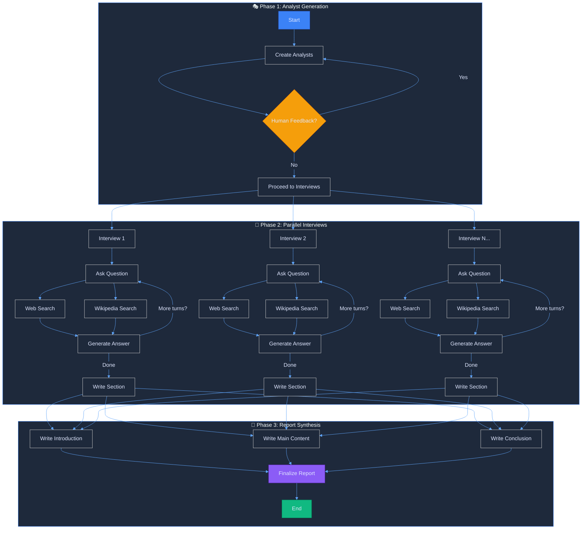
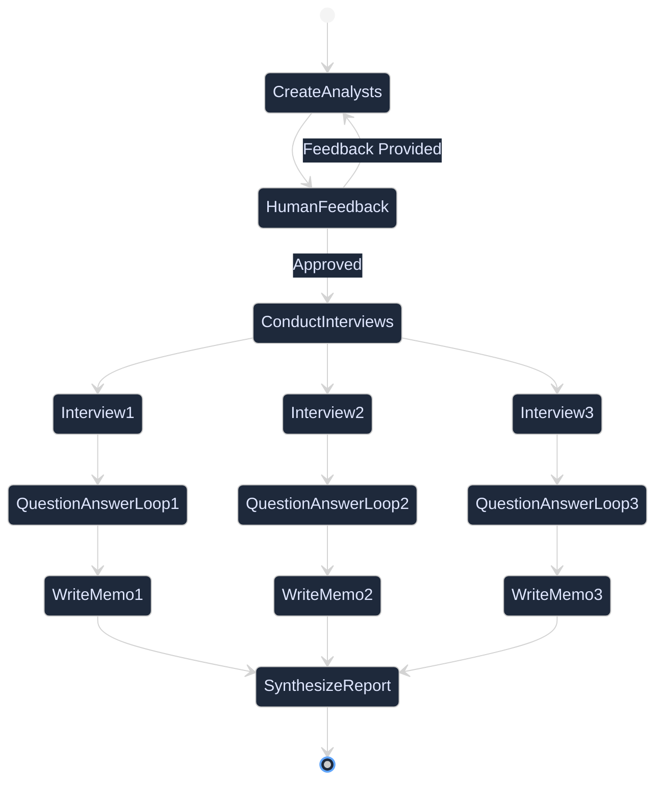

# 🔬 AI Research Assistant

> An intelligent multi-agent research system powered by LangGraph that generates comprehensive reports through AI-driven analyst personas and automated interviews.

<div align="center">


</div>

---

## 📋 Table of Contents

- [Overview](#-overview)
- [Architecture](#-architecture)
- [Features](#-features)
- [How It Works](#-how-it-works)
- [Installation](#-installation)
- [Usage](#-usage)
- [Configuration](#-configuration)
- [Example Output](#-example-output)
- [Technologies](#-technologies)

---

## 🎯 Overview

The AI Research Assistant is a sophisticated agent-based system that automates the research process by:

1. **Creating specialized AI analyst personas** tailored to your research topic
2. **Conducting parallel interviews** with AI experts across multiple domains
3. **Gathering information** from web searches and Wikipedia
4. **Synthesizing findings** into comprehensive, well-structured reports

This system leverages the power of **LangGraph** for orchestrating complex multi-agent workflows with human-in-the-loop feedback.

---

## 🏗️ Architecture



---

## ✨ Features

### 🤖 **Intelligent Analyst Creation**
- Automatically generates specialized analyst personas based on your research topic
- Each analyst has a unique role, affiliation, and research focus
- Human-in-the-loop feedback for refining analyst selection

### 🔄 **Parallel Processing**
- Conducts multiple interviews simultaneously using LangGraph's `Send()` API
- Significantly reduces research time through parallelization
- Each analyst operates independently for diverse perspectives

### 🔍 **Multi-Source Research**
- **Web Search**: Powered by Tavily for real-time web information
- **Wikipedia**: Academic and encyclopedic knowledge base
- Automatic source citation and reference management

### 📊 **Structured Output**
- Pydantic models ensure consistent data structures
- Markdown-formatted reports with proper citations
- Organized sections: Introduction, Insights, Conclusion, Sources

### 💾 **Stateful Memory**
- LangGraph checkpointing for resumable workflows
- State persistence across interruptions
- Human feedback integration at critical decision points

---

## 🔄 How It Works

### Step 1: Analyst Generation
```python
# Define your research topic
topic = "The benefits of adopting LangGraph as an agent framework"
max_analysts = 3

# System generates specialized analyst personas
# Example analysts:
# - Framework Architect (Technical perspective)
# - Startup CEO (Business perspective)
# - ML Engineer (Implementation perspective)
```

### Step 2: Human Feedback Loop
```python
# Review generated analysts
# Provide feedback to refine selection
graph.update_state(thread, {
    "human_analyst_feedback": "Add someone from a startup for entrepreneur perspective"
}, as_node="human_feedback")
```

### Step 3: Parallel Interviews
Each analyst:
1. **Asks targeted questions** based on their expertise
2. **Searches the web and Wikipedia** for relevant information
3. **Receives expert answers** synthesized from multiple sources
4. **Conducts follow-up questions** (configurable turns)
5. **Writes a detailed memo** with citations

### Step 4: Report Synthesis
- **Introduction**: Compelling overview of findings
- **Main Content**: Consolidated insights from all analyst memos
- **Conclusion**: Summary of key takeaways
- **Sources**: Complete reference list

---

## 🚀 Installation

### Prerequisites
- Python 3.8 or higher
- API keys for:
  - Groq (for LLM access)
  - Tavily (for web search)

### Setup

1. **Clone the repository**
```bash
git clone <your-repo-url>
cd "RESEARCH ASSISTANT"
```

2. **Install dependencies**
```bash
pip install langchain langchain-groq langchain-community langgraph python-dotenv pydantic wikipedia tavily-python
```

3. **Configure environment variables**

Create a `.env` file in the project root:
```env
GROQ_API_KEY=your_groq_api_key_here
TAVILY_API_KEY=your_tavily_api_key_here
```

---

## 💻 Usage

### Basic Usage

```python
from dotenv import load_dotenv
load_dotenv()

# Define research parameters
topic = "Your research topic here"
max_analysts = 3
thread = {"configurable": {"thread_id": "1"}}

# Start the research process
for event in graph.stream({
    "topic": topic,
    "max_analysts": max_analysts
}, thread, stream_mode="values"):
    analysts = event.get('analysts', '')
    if analysts:
        for analyst in analysts:
            print(f"Name: {analyst.name}")
            print(f"Role: {analyst.role}")
            print("-" * 50)
```

### With Human Feedback

```python
# Review initial analysts
# ... (run graph first)

# Provide feedback
graph.update_state(thread, {
    "human_analyst_feedback": "Add a data scientist perspective"
}, as_node="human_feedback")

# Continue with updated analysts
for event in graph.stream(None, thread, stream_mode="values"):
    # Process results...
```

### Generate Final Report

```python
# Continue until completion
for event in graph.stream(None, thread, stream_mode="updates"):
    node_name = next(iter(event.keys()))
    print(f"Processing: {node_name}")

# Retrieve final report
final_state = graph.get_state(thread)
report = final_state.values.get('final_report')

# Display as Markdown
from IPython.display import Markdown
Markdown(report)
```

---

## ⚙️ Configuration

### Customizable Parameters

| Parameter | Description | Default | Type |
|-----------|-------------|---------|------|
| `topic` | Research topic to investigate | Required | `str` |
| `max_analysts` | Number of analyst personas to create | 3 | `int` |
| `max_num_turns` | Questions per interview | 2 | `int` |
| `tavily_max_results` | Max search results per query | 3 | `int` |
| `wikipedia_max_docs` | Max Wikipedia documents | 2 | `int` |

### LLM Configuration

Currently configured to use **Groq's Llama 3.3 70B**:

```python
from langchain_groq import ChatGroq
llm = ChatGroq(model="llama-3.3-70b-versatile")
```

You can switch to other models:
```python
# OpenAI
from langchain_openai import ChatOpenAI
llm = ChatOpenAI(model="gpt-4")

# Anthropic
from langchain_anthropic import ChatAnthropic
llm = ChatAnthropic(model="claude-3-opus")
```

---

## 📄 Example Output

### Generated Analyst Personas

```
Name: Dr. Sarah Chen
Affiliation: Stanford AI Lab
Role: Framework Architect
Description: Focuses on technical architecture, scalability, and integration patterns
--------------------------------------------------

Name: Michael Rodriguez
Affiliation: TechFlow Startup
Role: CEO & Founder
Description: Evaluates business impact, adoption barriers, and ROI
--------------------------------------------------

Name: Alex Kumar
Affiliation: Google DeepMind
Role: Senior ML Engineer
Description: Examines implementation details, best practices, and performance
--------------------------------------------------
```

### Final Report Structure

```markdown
# The Future of Agent Frameworks: A Comprehensive Analysis

## Introduction
This report examines the benefits of adopting LangGraph as an agent framework...

---

## Insights

### Technical Architecture
LangGraph provides a robust state machine abstraction [1]...

### Business Value
Organizations report 40% reduction in development time [2]...

### Implementation Best Practices
Key patterns include checkpoint management and parallelization [3]...

---

## Conclusion
The research demonstrates that LangGraph offers significant advantages...

## Sources
[1] https://langchain-ai.github.io/langgraph/
[2] LangGraph Production Case Studies, 2024
[3] Building LLM Applications with LangGraph
```

---

## 🛠️ Technologies

<div align="center">

| Technology | Purpose |
|------------|---------|
| 🦜 **LangChain** | LLM orchestration and prompt management |
| 🔗 **LangGraph** | Multi-agent workflow orchestration |
| 🤖 **Groq** | High-speed LLM inference (Llama 3.3) |
| 🔍 **Tavily** | Real-time web search API |
| 📚 **Wikipedia** | Knowledge base retrieval |
| ✅ **Pydantic** | Data validation and structured outputs |
| 💾 **MemorySaver** | State persistence and checkpointing |

</div>

---

## 🎨 Workflow Visualization



---

## 🔍 Key Components

### 1️⃣ Analyst Model
```python
class Analyst(BaseModel):
    affiliation: str  # Organization/institution
    name: str         # Analyst name
    role: str         # Professional role
    description: str  # Focus areas and expertise
```

### 2️⃣ Interview State
```python
class InterviewState(MessagesState):
    max_num_turns: int       # Conversation turns
    context: list            # Retrieved documents
    analyst: Analyst         # Current analyst
    interview: str           # Transcript
    sections: list           # Written sections
```

### 3️⃣ Research Graph State
```python
class ResearchGraphState(TypedDict):
    topic: str                    # Research topic
    max_analysts: int             # Number of analysts
    human_analyst_feedback: str   # User feedback
    analysts: List[Analyst]       # All analysts
    sections: list                # Interview memos
    introduction: str             # Report intro
    content: str                  # Main content
    conclusion: str               # Report conclusion
    final_report: str            # Complete report
```

---

## 🎯 Use Cases

✅ **Market Research**: Analyze trends from multiple expert perspectives  
✅ **Technology Evaluation**: Assess tools and frameworks comprehensively  
✅ **Literature Review**: Synthesize academic and web sources  
✅ **Competitive Analysis**: Multi-angle competitor evaluation  
✅ **Due Diligence**: In-depth research for investment decisions  
✅ **Educational Content**: Generate well-researched learning materials  

---

## 🤝 Contributing

Contributions are welcome! Areas for enhancement:

- [ ] Add more retrieval sources (arXiv, Google Scholar, etc.)
- [ ] Implement streaming for real-time updates
- [ ] Add export formats (PDF, DOCX)
- [ ] Create web UI with Streamlit
- [ ] Add multi-language support
- [ ] Implement cost tracking and optimization

---

## 📝 License

This project is open source and available under the [MIT License](LICENSE).

---

## 🙏 Acknowledgments

- Built with [LangGraph](https://langchain-ai.github.io/langgraph/) by LangChain
- Powered by [Groq](https://groq.com/) for fast LLM inference
- Search capabilities by [Tavily](https://tavily.com/)

---

<div align="center">

**Made with ❤️ and 🤖**

⭐ Star this repo if you find it helpful!

</div>
